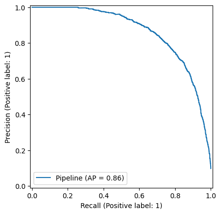

# Toxic Text Detection

This is a pet project to learn the basics of machine learning.

## Screenshots

  
  
  
  
  

## Requirements

- `python 3.13+`
- `uv`

## Using

1. Download requirements
    ```bash
    $ uv sync 
    ```
2. Run `main.py`
    ```bash
    uv run main.py
    ```
3. Go to browser and open `localhost:8000/`

## Metrics
Below is the Precision-Recall curve generated based on the metrics of the trained model:


The Precision-Recall curve presented above is plotted using the dataset retrieved from [Kaggle's "Jigsaw Toxic Comment Classification Challenge" (train.csv)](https://www.kaggle.com/datasets/julian3833/jigsaw-toxic-comment-classification-challenge?select=train.csv). The curve gives a graphical illustration of the precision-recall trade-off for various threshold values of our model for detecting toxic text.
Key Observations:

High Precision at Low Recall : The curve starts with high precision (close to 1.0) at low recall rates, which means that when the model predicts a comment to be toxic, it is very likely to be correct. It means that the model is conservative in its predictions, prioritizing accuracy over detecting all possible toxic comments.

Graceful Decline : As the recall rises, the precision steadily falls. This is to be expected, as raising the recall usually means lowering the prediction threshold, which will result in more false positives and hence lower precision.

Area Under the Curve (AUC) : The AUC for this curve is 0.86, indicating good performance by the model. If the AUC were 1.0, then it would be a perfect classifier, and if it were 0.5, then it would be just random guessing. So, an AUC of 0.86 indicates that the model can distinguish well between toxic and non-toxic posts.

Balanced Performance : The line is quite steep even as the recall increases, indicating that the model is successfully balancing the rate of correctly identifying toxic posts with the number of false positives. This makes it particularly well-suited to uses where it is costly for false negatives (to forego toxic posts).

In this context, the Precision-Recall curve illustrates that our model for detecting toxic text is good on the Jigsaw Toxic Comment Classification dataset. It exhibits a strong ability to identify toxic comments with high precision, especially at low recall levels, and possesses a perfect trade-off between precision and recall across various thresholds. The AUC score of 0.86 further supports the efficiency of the model in distinguishing between toxic and non-toxic comments.

