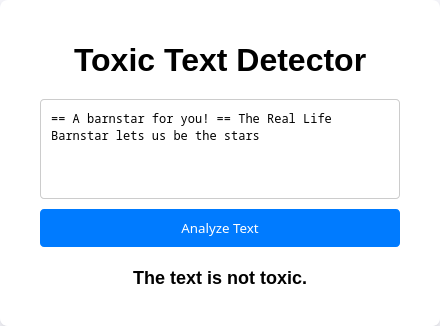
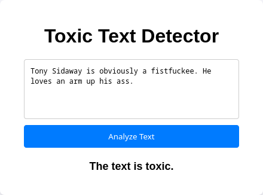

# Toxic Text Detection

This is a pet project to learn the basics of machine learning.

## Screenshots

  
  
  
  
  

## Requirements

- `python 3.13+`
- `uv`

## Using

1. Download requirements
    ```bash
    $ uv sync 
    ```
2. Run `main.py`
    ```bash
    uv run main.py
    ```
3. Go to browser and open `localhost:8000/`


